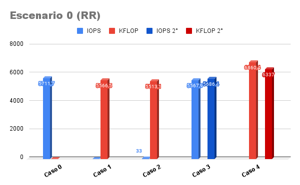
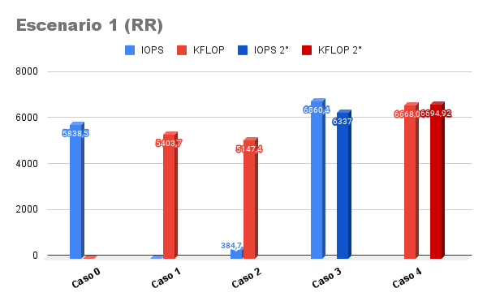
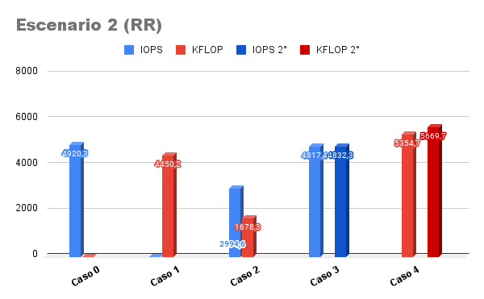
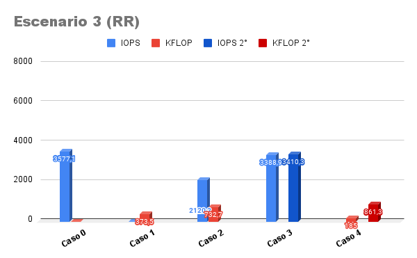
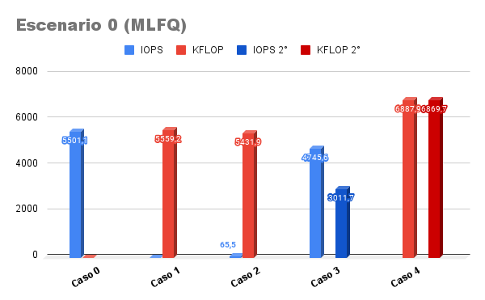
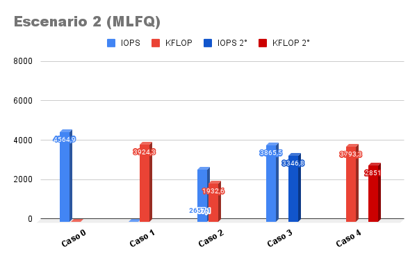
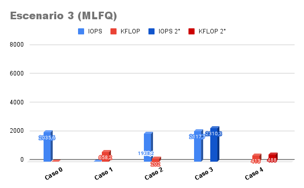

# Laboratorio 3, Planificador de procesos
## Introducción:

Un planificador es una función esencial en cualquier sistema operativo. Es un programa que permite asignar recursos a uno de los procesos del sistema.
Existen varios algoritmos para decidir qué procesos correr y por cuánto tiempo, en este trabajo se busca estudiar el algoritmo de planificación en xv6,
analizando ventajas y desventajas de esta política, además de implementar nuestra propia política. 

El planificador que usa xv6 utiliza Round-Robin como política.
Esta consiste en asignar un intervalo de tiempo determinado de ejecución que llamaremos Quantum. Cuando un proceso que está corriendo agota su quantum este es obligado mediante una interrupción por reloj a ceder el CPU, 
luego se elige al siguiente proceso listo para ocupar el CPU. El tiempo de CPU también es alternado si el proceso se bloquea antes de terminar el quantum. En start.c el quantum se define como 1000000 ciclos de CPU.
El algoritmo que utiliza xv6 recorre una cola ordenada por tiempo de llegada donde se encuentran los procesos y ejecuta al primer proceso que se encuentre listo para ser ejecutado.
Tras ser elegido se realiza un cambio de contexto de una duración constante (se guardan y cargan 14 registros) y el proceso corre. 

Cómo el planificador afecta a los procesos

Observando el código de xv6 que el cambio de contexto consume tiempo del quantum y que es importante tenerlo en cuenta para el correcto funcionamiento del sistema.

Planteamos como hipótesis que un quantum muy pequeño provoca que el gasto extra por el cambio de contexto se convierta en el factor dominante y los demás procesos se ejecutan por muy poco tiempo,
un quantum muy largo y la política se convierte en algo similar a un algoritmo FIFO (First In First Out). 

Por otro lado, planteamos que los procesos I/O-bound, al bloquearse más seguido que los procesos CPU-bound, van a tener más tiempo de ejecución a medida de que se reduce el quantum que los CPU-bound,
ya que al haber menos tiempo de espera antes de volver de ser elegido, va a ser ejecutado más veces.

## Métricas: 

Para cada planificador se realizaron cinco casos de mediciones utilizando los programas iobench, respuesta de entrada/salida, y cpubench que mide poder de cómputo,
en cuatro escenarios distintos variando el tamaño del quantum.
Se realizaran las mediciones en una computadora con las siguientes características:

-   CPU: Intel i5-4200M (4) @ 3.100GHz    
-   Memoria: 3848MiB**

### Casos:

• Caso 0: iobench solo.

• Caso 1: cpubench solo.

• Caso 2: 1 iobench con 1 cpubench.

• Caso 3: 1 iobench con 1 iobench.

• Caso 4: 1 cpubench con 1 cpubench.

### Escenarios

• Escenario 0: quantum por defecto.

• Escenario 1: quantum 10 veces más corto.

• Escenario 2: quantum 100 veces más corto.

• Escenario 3: quantum 1000 veces más corto.









Observamos por las métricas que al reducir demasiado el quantum sucede que, como habíamos planteado, el cambio de contexto consume demasiado tiempo del mismo,
como se ve en el escenario 3 donde se reduce demasiado las operaciones de ambos procesos en todos los casos.  
Lo planteado sobre el aumento de tiempo de ejecución de los I/O-bound sobre los CPU-bound, sucede como se puede ver en los casos 2 de los diferentes escenarios.
Por lo tanto concluimos que nuestra hipotesis eran correctas.

## MLFQ:
Nuestra política implementada sigue las siguientes reglas:

• Regla 1: Si el proceso A tiene mayor prioridad que el proceso B, corre A. (y no B)  

• Regla 2: Si dos procesos A y B tienen la misma prioridad, corren en round-robin por el quantum determinado.

• Regla 3: Cuando un proceso se inicia su prioridad será máxima 

• Regla 4: Descender de prioridad cada vez que el proceso pasa todo un quantum realizando cómputo.

• Regla 5: Ascender de prioridad cada vez que el proceso se bloquea antes de terminar su quantum
  
Definimos en proc.h a cero como la máxima prioridad y NPRIO-1 (número de prioridades) como la mínima. Para ello a la estructura de los procesos les designamos un campo que indica su prioridad.

El algoritmo loopea cada entrada en la tabla de procesos por cada prioridad eligiendo al primero que tenga la prioridad correspondiente.
```c
uint i = 0;

while(i < NPRIO){    

     for(p = proc; p < &proc[NPROC]; p++){

       acquire(&p->lock);

       if(p->state == RUNNABLE && p->priority == i)
```


Una vez elegido el proceso se realiza el cambio de contexto, luego se actualizan las prioridades según las reglas establecidas.


```c 

         swtch(&c->context, &p->context);

         if (p->priority > 0 && p->state == SLEEPING)

           p->priority--;

         else if (p->priority < NPRIO-1) 

           p->priority++;
```


Una vez recorrida la tabla de procesos para la prioridad “i” esta se incrementa.

Para esta implementación con estas reglas esperamos un mayor dominio de los procesos I/O-bound.

  
  

## MÉTRICAS








Por lo visto en las métricas, y al igual que con Round-Robin, aún debemos tener en cuenta el cambio de contexto a la hora de determinar el largo del quantum. 
También observamos que se cumple lo esperado, por las reglas 4 y 5 los procesos I/O-bound correrán en prioridades altas mientras que procesos CPU-bound en prioridades más bajas.
Con estas reglas se produce Starvation, procesos CPU-bound se ven perjudicados ya que al utilizar todo su quantum sus prioridades son reducidas, mientras procesos I/O-bound que se bloquean más seguido se ven beneficiados y acaparan el CPU.

## Conclusión

### Comparacion RR y MLFQ

  En resumen al comparar el nuevo planificador MLFQ con el RR implementado en xv6 notamos que ambos tienen el mismo problema con el cambio de contexto,
  es decir ambos al reducirse demasiado el quantum el cambio de contexto acapara más la CPU producciones starvation a los procesos.
  El MLFQ, teniendo en cuenta los escenarios con quantum normal  (escenario 0 y 1), mejora el tiempo de respuesta del sistema operativo al provocar que los procesos I/O-bound tengan más tiempo ejecución,
  como se ve en los casos 2 de los gráficos donde los procesos I/O-bound en MLFQ hacen el doble de operaciones que en RR.
  No podemos decir que uno es mejor que el otro, porque cada uno tiene sus ventajas y desventajas ya mencionadas durante el informe.
